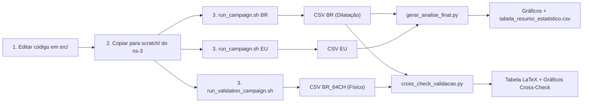

# Contexto Geral do Projeto — TCC Nícolas Rafael Silva Alves

## Instituição: IFPI (Instituto Federal do Piauí)
## Tema: Análise de Escalabilidade em Redes LoRaWAN Massivas
## Simulador: ns-3.45 (C++) com módulo LoRaWAN (Universidade de Padova)

---

## 1. Objetivo do TCC

Avaliar a escalabilidade de redes LoRaWAN massivas (de 100 até 5.000 end devices) comparando **duas estratégias de alocação de Spreading Factor (SF)** em **duas regiões regulatórias distintas**, utilizando simulação de eventos discretos no ns-3.

As duas estratégias comparadas são:
- **Cenário 1 — Alocação Estática Baseada em Distância:** Cada nó recebe um SF fixo (SF7 a SF12) conforme a sua distância ao gateway, calculada a partir da sensibilidade do receptor SX1276.
- **Cenário 2 — ADR (Adaptive Data Rate):** O Network Server otimiza dinamicamente o SF de cada nó com base na qualidade do enlace (SNR), seguindo o algoritmo padrão LoRaWAN.

As duas regiões regulatórias são:
- **EU868 (Europa):** 3 canais obrigatórios (868.1, 868.3, 868.5 MHz), duty cycle de 1%, potência TX de 14 dBm.
- **AU915 (Brasil):** 64 canais de uplink (902.3–914.9 MHz, 200 kHz de espaçamento), sem restrição severa de duty cycle, potência TX de 30 dBm (1W EIRP).

---

## 2. A Inovação Técnica: Modelo de Dilatação Temporal

### 2.1. O Problema
O módulo LoRaWAN do ns-3 foi desenvolvido para a banda EU868 e possui duas limitações estruturais que impedem a simulação direta do padrão AU915:
1. O `LorawanMacHelper` instancia o `LogicalLoraChannelHelper` com tamanho fixo de **16 canais** (hardcoded). AU915 exige 64.
2. O método `GetChannelForTx()` seleciona aleatoriamente entre os canais marcados como `EnabledForUplink`, que na configuração EU padrão são apenas os 3 primeiros.

### 2.2. A Solução
Em vez de patchar o core do ns-3 (o que comprometeria a reprodutibilidade), foi criado o **Modelo de Emulação por Dilatação Temporal**. O fundamento matemático é o modelo ALOHA puro:

```
G = λ · T_air    (carga oferecida normalizada)
P_sucesso = e^(-2G)
```

A carga G pode ser reduzida de duas formas equivalentes:
- Aumentar o número de canais (dilui λ por canal)
- Aumentar o intervalo entre transmissões (reduz λ global)

Portanto: **3 canais com período × (64/3) ≡ 64 canais com período × 1**

### 2.3. Implementação no Código
```cpp
// lora-tcc-nicolas.cc — linhas 113-120
double simulatedAppPeriod = appPeriod;       // 600s (10 min)
double scalingFactor = 1.0;

if (region == "BR") {
    simulatedAppPeriod = appPeriod * (64.0 / 3.0);  // ≈ 12800s
    scalingFactor = (64.0 / 3.0);                    // ≈ 21.33
}
```

Os contadores de colisões e pacotes na saída CSV são multiplicados por `scalingFactor` para refletir a escala real.

### 2.4. Validação Empírica (Cross-Check)
Para provar que a Dilatação Temporal é válida, foi criado um segundo script C++ (`lora-tcc-validacao-au915.cc`) que **instancia fisicamente 64 canais AU915** no ns-3 através de bypass do `LorawanMacHelper` (injeção direta via `SetLogicalLoraChannelHelper`). A convergência de PDR entre os dois métodos (Δ < 1 ponto percentual) valida o modelo. Detalhes completos no ficheiro `VALIDACAO_CROSSCHECK.md`.

---

## 3. Parâmetros Fixos da Simulação

| Parâmetro | Valor | Justificativa |
|---|---|---|
| Tempo de simulação | 86.400s (24 horas) | Garantir regime estacionário (Lei de Little) |
| Período da aplicação | 600s (10 minutos) | Intervalo típico de telemetria IoT |
| Tamanho do pacote | 51 bytes | Payload máximo LoRaWAN para DR0 (SF12) |
| Raio da rede | 5.000 metros | Cobertura típica de um gateway LoRaWAN urbano/suburbano |
| Topologia | Estrela (1 gateway central) | Arquitetura padrão LoRaWAN |
| Altitude do gateway | 15 metros | Altura de torre/poste típica |
| Distribuição dos nós | Uniforme num disco (UniformDiscPositionAllocator) | Garante distribuição isotrópica |
| Número de sementes | 33 por configuração | Teorema do Limite Central → IC 95% robusto |
| Densidades testadas | 100, 500, 1.000, 2.000, 5.000 nós | Curva de escalabilidade completa |

---

## 4. Modelo de Propagação

```cpp
Ptr<LogDistancePropagationLossModel> loss;
loss->SetPathLossExponent(2.8);
loss->SetReference(1.0, 46.37);  // PL(d0=1m) = 46.37 dB
```

Modelo Log-Distance com expoente 2.8 (ambiente suburbano). A perda de percurso é:
```
PL(d) = 46.37 + 28·log10(d)  [dB]
```

---

## 5. Limiares de SF por Distância (Cenário 1 — Estático)

Calculados cruzando a sensibilidade RX do SX1276 com o modelo de propagação a 30 dBm:

| SF (DR) | Sensibilidade RX | Distância Máxima |
|---|---|---|
| SF7 (DR5) | -123 dBm | < 1.330 m |
| SF8 (DR4) | -126 dBm | < 1.690 m |
| SF9 (DR3) | -129 dBm | < 2.150 m |
| SF10 (DR2) | -132 dBm | < 2.720 m |
| SF11 (DR1) | -134.5 dBm | < 3.320 m |
| SF12 (DR0) | -137 dBm | ≥ 3.320 m |

---

## 6. Modelo de Energia

| Parâmetro | BR (AU915) | EU (EU868) |
|---|---|---|
| Corrente TX | 350 mA (30 dBm) | 28 mA (14 dBm) |
| Corrente RX | 11.2 mA | 11.2 mA |
| Corrente Standby | 1.4 mA | 1.4 mA |
| Corrente Sleep | 1.5 µA | 1.5 µA |
| Tensão de alimentação | 3.3 V | 3.3 V |
| Energia inicial | 10.000 J | 10.000 J |

> **Nota sobre Energia na Dilatação Temporal:** Os valores de energia medidos na campanha principal (região BR) são "tempo-comprimidos". Para obter o consumo real equivalente a uma rede de 64 canais, multiplicar por 21.33 (64/3). Validação: 13.4 J × 21.33 ≈ 286 J ≈ 294 J medidos na validação física.

---

## 7. Métricas Coletadas

### 7.1. PDR (Packet Delivery Ratio)
```
PDR = (Pacotes Recebidos no NS / Pacotes Enviados pelos EDs) × 100%
```
Métrica principal de fiabilidade da rede. Calculada globalmente e por nó.

### 7.2. Índice de Justiça de Jain
```
J = (Σ PDR_i)² / (N × Σ PDR_i²)
```
Mede a equidade na distribuição de recursos. J = 1.0 significa que todos os nós têm a mesma taxa de entrega. Valores abaixo de 0.9 indicam que há nós "privilegiados" e nós "famintos".

### 7.3. Consumo Energético Médio
```
E_médio = Σ (E_inicial - E_restante) / N    [Joules/Nó]
```
Extraído do `BasicEnergySource` do ns-3 após 24h de simulação.

### 7.4. Latência Média
```
Lat = Σ (t_rx - t_tx) / Total_pacotes_recebidos    [segundos]
```
Tempo entre o envio pelo ED e a receção no Network Server. Dominada pelo Time-on-Air do SF utilizado.

### 7.5. Decomposição de Perdas (Raio-X do Gateway)
Os pacotes perdidos são classificados em 3 categorias pela camada PHY do gateway:
- **Colisões ALOHA (Interferência):** Dois ou mais pacotes transmitidos simultaneamente na mesma frequência e SF destrutíveis.
- **Sinal Fraco (UnderSensitivity):** O sinal chegou abaixo da sensibilidade do receptor.
- **Saturação (NoReceivers):** O gateway não tinha demoduladores livres (máx. 8 paths por SX1301).

O cálculo de colisões ALOHA "reais" é inferido:
```
Colisões_ALOHA = (Enviados - Recebidos) - Sinal_Fraco - Saturação
```

### 7.6. Distribuição de DR/SF
Contagem final de quantos nós utilizam cada Data Rate (DR0/SF12 a DR5/SF7). No Cenário 1, é fixo por distância. No Cenário 2 (ADR), o NS otimiza dinamicamente.

---

## 8. Formato de Saída CSV

### 8.1. Campanha Principal (`lora-tcc-nicolas.cc`)
Tag: `[RES]`
```
Regiao,Cenario,Nos,EnergiaTotalExt_J,EnergiaMedia_J,PDR_Percent,JainIndex,
TempoExec_s,LatenciaMedia_s,PerdasColisaoExt,PerdasSinalFracoExt,
PerdasSaturacaoExt,DR0_SF12,DR1_SF11,DR2_SF10,DR3_SF9,DR4_SF8,DR5_SF7,Semente
```

### 8.2. Validação Física (`lora-tcc-validacao-au915.cc`)
Tag: `[RES_VAL]`
Mesmo formato, mas região = `BR_64CH` e sem `scalingFactor` aplicado.

---

## 9. Estrutura do Repositório

```
TCC-LoRaWAN-Scalability/
│
├── src/                                    # Código-fonte C++ (cópia do scratch/)
│   ├── lora-tcc-nicolas.cc                 # Simulação principal (Dilatação Temporal)
│   └── lora-tcc-validacao-au915.cc         # Validação (64 Canais Físicos AU915)
│
├── scripts/                                # Automação
│   ├── run_campaign.sh                     # Motor multi-core campanha principal
│   ├── run_validation_campaign.sh          # Motor multi-core validação
│   ├── gerar_analise_final.py              # Gráficos comparativos BR vs EU
│   └── gerar_graficos.py                   # Gráficos individuais por região
│
├── cross_check_validacao.py                # Comparador Dilatação vs Físico + LaTeX + Gráficos
├── sync_from_ns3.sh                        # Sincronização ns-3 scratch/ → src/
├── VALIDACAO_CROSSCHECK.md                 # Documentação do Cross-Check
│
├── results/
│   ├── CSV/
│   │   ├── resultados_lorawan_BR_*.csv         # Campanha BR (Dilatação)
│   │   ├── resultados_lorawan_EU_*.csv         # Campanha EU
│   │   ├── resultados_lorawan_BR64CH_*.csv     # Validação 64 canais
│   │   └── tabela_resumo_estatistico.csv       # Média ± IC95% consolidado
│   ├── Graficos_Comparativos/                  # PNGs 300dpi para o TCC
│   ├── Graficos/                               # Gráficos individuais
│   └── logs/                                   # Stderr do ns-3 (debug)
│
├── README.md
└── LICENSE (GPL v3)
```

---

## 10. Ambiente de Execução

| Item | Valor |
|---|---|
| SO | Pop!_OS (Linux) |
| Simulador | ns-3.45 (ns-allinone-3.45) |
| Módulo LoRaWAN | contrib/lorawan (Padova, versão ns-3.45) |
| Caminho do ns-3 | `~/Documents/Nicolas/ns-allinone-3.45/ns-3.45/` |
| Caminho do repositório | `~/Documents/Nicolas/TCC-LoRaWAN-Scalability/` |
| Localização do código no ns-3 | `scratch/lora-tcc-nicolas.cc` e `scratch/lora-tcc-validacao-au915.cc` |
| Python | 3.10 (matplotlib, pandas, seaborn, numpy) |
| Paralelismo | 10 jobs simultâneos (GNU parallel via bash `&`) |

---

## 11. Pipeline de Execução Completo



---

## 12. Resultados Consolidados (Campanha Principal — 33 sementes)

### 12.1. Brasil (AU915 — Dilatação Temporal)

| Nós | PDR Estático | PDR ADR | Jain Estático | Jain ADR |
|---|---|---|---|---|
| 100 | 99.60 ± 0.19% | 98.33 ± 0.38% | 0.998 | 0.995 |
| 500 | 98.54 ± 0.15% | 93.19 ± 0.30% | 0.994 | 0.981 |
| 1.000 | 96.82 ± 0.16% | 87.48 ± 0.22% | 0.986 | 0.963 |
| 2.000 | 94.09 ± 0.16% | 78.65 ± 0.22% | 0.973 | 0.925 |
| 5.000 | 86.02 ± 0.15% | 60.41 ± 0.13% | 0.929 | 0.817 |

### 12.2. Europa (EU868)

| Nós | PDR Estático | PDR ADR | Jain Estático | Jain ADR |
|---|---|---|---|---|
| 100 | 92.80 ± 0.68% | 95.06 ± 0.54% | 0.974 | 0.960 |
| 500 | 73.24 ± 0.59% | 78.70 ± 0.66% | 0.863 | 0.821 |
| 1.000 | 56.99 ± 0.55% | 57.29 ± 0.58% | 0.707 | 0.644 |
| 2.000 | 38.26 ± 0.30% | 18.78 ± 0.17% | 0.458 | 0.267 |
| 5.000 | 15.81 ± 0.19% | 1.54 ± 0.05% | 0.186 | 0.021 |

### 12.3. Conclusões-Chave dos Dados
1. **AU915 escala drasticamente melhor que EU868:** Com 5.000 nós, BR mantém PDR de 86% vs 16% na EU (cenário estático). A vantagem dos 64 canais é esmagadora.
2. **Estático supera ADR em redes densas:** O ADR gera overhead de controle (MAC commands) que consome capacidade e agrava colisões em redes massivas.
3. **EU868 colapsa acima de 1.000 nós:** O gargalo dos 3 canais com duty cycle de 1% torna a rede EU inviável para IoT massivo.
4. **Jain Index confirma injustiça:** Abaixo de 0.9, há nós severamente prejudicados. Na EU com 5.000 nós e ADR, J ≈ 0.02 indica que quase nenhum nó consegue entregar pacotes.

---

## 13. Limitações Conhecidas

1. **ADR com 64 canais físicos:** O ns-3 nativo não suporta `ChMaskCntl` para AU915. O ADR crasha com Segfault quando o Network Server tenta enviar `LinkADRReq` para >16 canais. Isto foi documentado e prova a necessidade da Dilatação Temporal.
2. **Energia na Dilatação Temporal:** Os valores de energia no modelo dilatado são "comprimidos" e devem ser multiplicados por 21.33 para comparação direta com a simulação física.
3. **Topologia simplificada:** Um único gateway central. Redes reais usam múltiplos gateways com macro-diversidade.
4. **Modelo de propagação:** Log-Distance sem fading (Rayleigh/Rice). O cenário é determinístico para cada semente — não modela desvanecimento rápido.

---

## 14. Referências Técnicas Internas

- Código principal: [lora-tcc-nicolas.cc](file:///home/labiras/Documents/Nicolas/TCC-LoRaWAN-Scalability/src/lora-tcc-nicolas.cc)
- Código de validação: [lora-tcc-validacao-au915.cc](file:///home/labiras/Documents/Nicolas/TCC-LoRaWAN-Scalability/src/lora-tcc-validacao-au915.cc)
- Motor de campanha BR/EU: [run_campaign.sh](file:///home/labiras/Documents/Nicolas/TCC-LoRaWAN-Scalability/scripts/run_campaign.sh)
- Motor de campanha validação: [run_validation_campaign.sh](file:///home/labiras/Documents/Nicolas/TCC-LoRaWAN-Scalability/scripts/run_validation_campaign.sh)
- Cross-check Python: [cross_check_validacao.py](file:///home/labiras/Documents/Nicolas/TCC-LoRaWAN-Scalability/cross_check_validacao.py)
- Análise estatística: [gerar_analise_final.py](file:///home/labiras/Documents/Nicolas/TCC-LoRaWAN-Scalability/scripts/gerar_analise_final.py)
- Documentação Cross-Check: [VALIDACAO_CROSSCHECK.md](file:///home/labiras/Documents/Nicolas/TCC-LoRaWAN-Scalability/VALIDACAO_CROSSCHECK.md)

---

*Documento de contexto — TCC Nícolas Rafael Silva Alves, IFPI — Atualizado em 28/04/2026*
