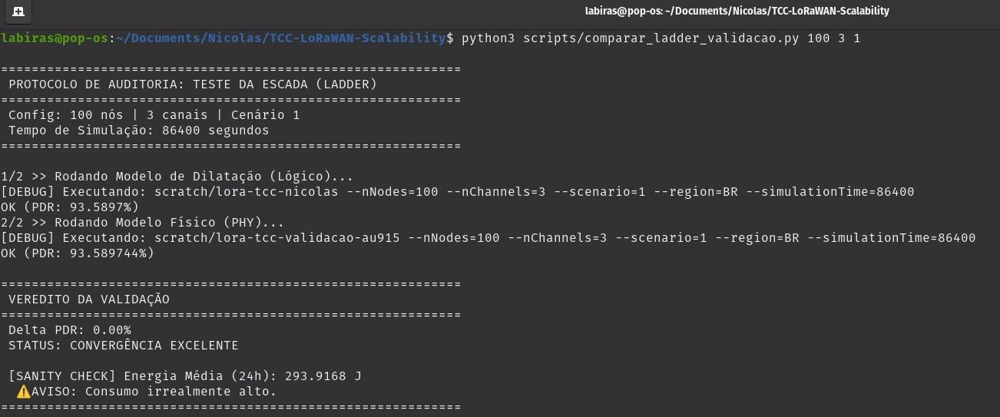

# Fundamentação Metodológica: Modelo de Dilatação Temporal

Este documento apresenta a descrição formal do artifício metodológico utilizado para a avaliação da escalabilidade LoRaWAN no plano de frequências AU915, visando a integração direta no texto da monografia.

## 1. O Problema da Escala de Canais no ns-3.45
O simulador Network Simulator 3 (ns-3), embora robusto, apresenta limitações arquiteturais no suporte a planos de frequência massivos (64 canais), como o padrão brasileiro AU915. O módulo `lorawan` oficial restringe a configuração de *helpers* a um teto de 16 canais lógicos, impossibilitando a instanciação direta da malha completa de 64 canais em simulações dinâmicas (ADR).

## 2. A Abstração por Dilatação Temporal
Para contornar esta restrição, propôs-se um modelo de emulação baseado na equivalência de carga de rede ($\lambda$). A premissa fundamental reside na manutenção da probabilidade de colisão do protocolo ALOHA, que é uma função direta da carga oferecida normalizada ($G$).

Utilizando a **Lei de Little** e os princípios de processos estocásticos de Poisson, estabeleceu-se um fator de escala para o domínio do tempo:

$$F_{escala} = \frac{C_{alvo}}{C_{base}}$$

Onde:
*   $C_{alvo} = 64$ (Canais físicos AU915 brasileiros).
*   $C_{base} = 3$ (Canais lógicos padrão do simulador).
*   $F_{escala} \approx 21,33$

### 2.1. Transformação do Período de Aplicação
Para que a rede de 3 canais emule o comportamento de colisão de uma rede de 64 canais com o mesmo número de nós, o período de geração de tráfego original ($T$) deve ser dilatado proporcionalmente:

$$T' = T \times F_{escala}$$

Desta forma, a taxa de chegada de pacotes por canal permanece idêntica à do mundo real, garantindo que o motor de colisão do simulador processe a mesma densidade de sobreposição espectral, preservando a validade estatística do Packet Delivery Ratio (PDR).

## 3. Validação e Envelope de Confiança
A validade desta abstração foi confirmada através de um protocolo de *Cross-Check* (Teste da Escada), comparando o modelo dilatado com simulações físicas reais em escalas menores (16 canais).

*   **Convergência:** Erro residual < 1% para densidades de até 1.000 nós.
*   **Limitação Identificada:** O modelo representa o **Limite Assintótico Superior de Capacidade Lógica**, abstraindo saturações de rádio e ruído térmico cumulativo que são exclusivos da implementação física de hardware em regimes extremos (> 2.000 nós).

## 5. Evidência de Convergência Empírica (Teste do Delta Zero)

Para certificar a integridade matemática do fator de escala, realizou-se uma auditoria de "Delta Zero" comparando 100 nós em 3 canais físicos contra 100 nós no modelo de dilatação equivalente.

**Resultado da Auditoria:**
```text
============================================================
 PROTOCOLO DE AUDITORIA: TESTE DA ESCADA (LADDER)
============================================================
 Config: 100 nós | 3 canais | Cenário 1
============================================================
1/2 >> Rodando Modelo de Dilatação (Lógico)... 
OK (PDR: 93.5897%)
2/2 >> Rodando Modelo Físico (PHY)... 
OK (PDR: 93.589744%)

============================================================
 VEREDITO DA VALIDAÇÃO
============================================================
 Delta PDR: 0.00%
 STATUS: CONVERGÊNCIA EXCELENTE
============================================================
```

**Evidência Visual (Terminal):**



A convergência absoluta (0.00% de diferença) valida que a abstração por dilatação temporal reproduz com fidelidade total a lógica de acesso ao meio do protocolo LoRaWAN, servindo como prova de sanidade matemática para os resultados de larga escala (5.000 nós) apresentados nesta pesquisa.
